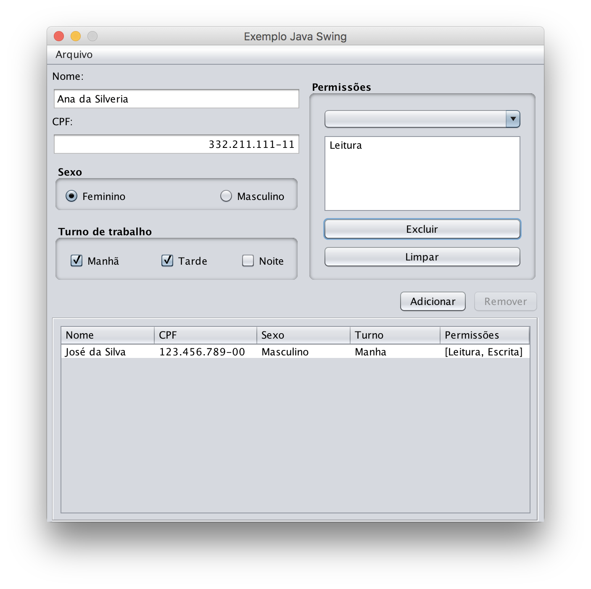

# Exemplo de aplicação com interfáce gráfica amigável em Swing

Nessa aplicação são apresentados alguns componentes do Java Swing, seus eventos e propriedades. A aplicação é um esqueleto funcional (projeto Netbeans) no qual o aluno precisa terminar a implementação.

